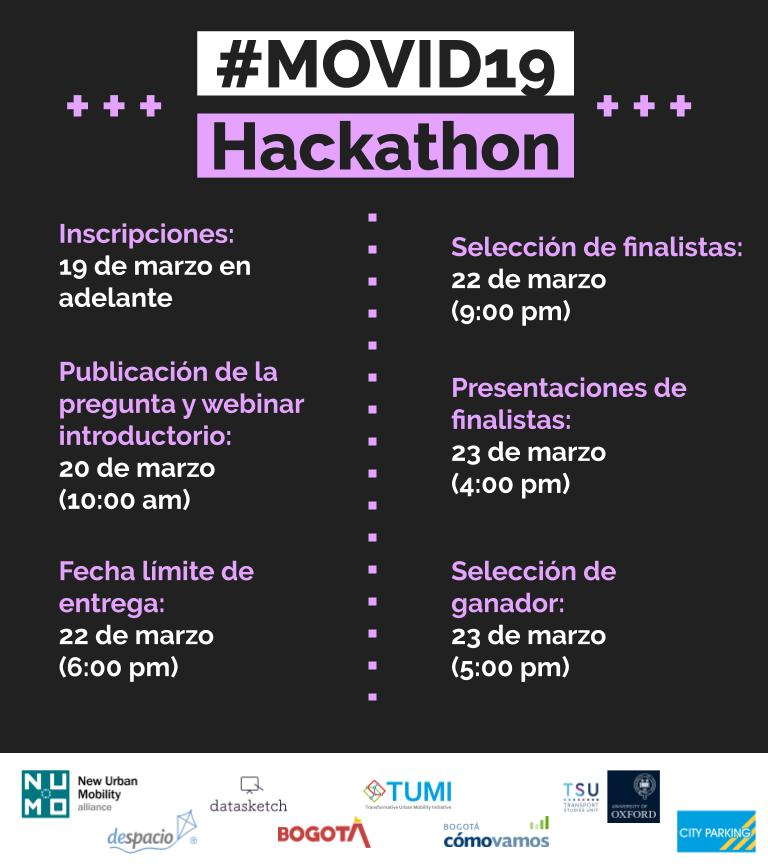

# MOVID-19
Hackatón para buscar soluciones al reto del Covid-19 en transporte público.

## ¿Qué es?

Frente a la pandemia global de COVID-19 y el gran reto que ha supuesto prestar un buen servicio de transporte público sin incrementar el riesgo de contagio - y la coyuntura de tener toda una ciudad en cuarentena durante cuatro días, NUMO en alianza con Datasketch, Despacio y otras organizaciones quieren premiar las mejores soluciones que se presenten a través de un hackaton que se lanzará el jueves 19 de Marzo en la noche y se premiará el lunes 23 de marzo en la tarde.

Se espera que el análisis de los datos sobre COVID-19 y movilidad en Bogotá, puedan aportar soluciones para el **mejoramiento en la calidad del transporte en la ciudad durante la pandemia**. Y a su vez que la solución permita que la Secretaría Distrital de Movilidad de Bogotá pueda implementar estrategias adecuadas para enfrentar la crisis y monitorear la información relevante.

## ¿Cómo participar?

1. Regístrate [aquí](https://forms.gle/6vZzhihhDFNrWrzc7). Puedes participar en grupos de máximo 3 personas.
1. Clona el repositorio para quedar inscrito. [Ver instructivo](./faq/pull-request.md)
1. Envía tu solución a a la [pregunta]() haciendo un pull request incluyendo una carpeta con tu nombre de GitHub. Asegúrate de mantener la estructura descrita en el [instructivo.](./faq/estructura-de-archivos.md)

Te puedes inscribir en cualquier momento antes de la fecha límite de envío de soluciones descrita en el [cronograma](#cronograma)

## Reglamento

Acá puede acceder al documento completo (pdf)[] con los términos y condiciones. A continuación un resumen sobre los temas importantes.

### Premio

1000 USD repartidos así entre los ganadores:

1. 750 USD al ganador
1. 150 USD al segundo lugar
1. 100 USD al tercer lugar

### Jurados

Los jurados se reservan el derecho de invitar a otros jurados expertos en temas de movilidad, salud pública o ciencia de datos.

### Criterios de evaluación

- Criterios de evaluación de proceso (D):
  - Apertura: Acceso abierto, colaboración.
  - Diseño: Gráfico de presentación de resultados.
  - Ciencia de datos: Metodología clara, flujos repiclables y reproducibles.
- Criterios de resultado (CFP):
  - Pertinencia: En movilidad y salud pública.
  - Viabilidad: Que el gobierno pudiese ejecutar las medidas al día siguiente.
  - Monitoreo: Que la efectividad de lo propuesto se pueda evaluar fácilmente.
  - Sostenibilidad: Que siga principios de transporte sostenible estándar en la literatura.

## Recursos

### Datos

En [esta página]() estaremos publicando todos los datos que puedan ser relevantes para dar respuesta a la pregunta de la hackatón.

## Cronograma

Agrega este [calendario](https://calendar.google.com/calendar?cid=bnVtby5nbG9iYWxfMmZlMnZtaHZmdGltdjdnaDhhZXVxMjJ0bm9AZ3JvdXAuY2FsZW5kYXIuZ29vZ2xlLmNvbQ)

## Preguntas frecuentes

## Organizaciones que apoyan

## Siguientes pasos

## Kit de prensa

## Webinar y conversaciones
